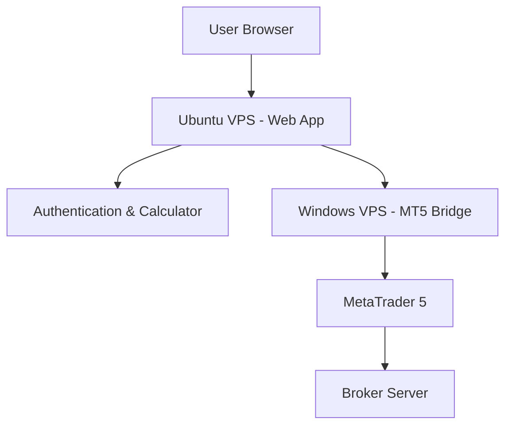

# 🚀 VPS Setup Guide for MT5 Integration

## 📋 ภาพรวม VPS Solution

การใช้ VPS (Virtual Private Server) เป็นวิธีที่ดีที่สุดในการเชื่อมต่อ MT5 กับ Web Calculator เพราะ:
- รันได้ 24/7 
- ความเร็วการเชื่อมต่อสูง
- ไม่ต้องเปิดคอมพิวเตอร์ตลอดเวลา
- รองรับ Windows MT5 API

---

## 🌐 **ขั้นตอนที่ 1: เลือกและสร้าง VPS**

### **🏆 VPS Providers แนะนำ:**

#### **1. AWS EC2 (สำหรับมืออาชีพ)**
```bash
# สเปคแนะนำ
- Instance Type: t3.medium (2 vCPU, 4GB RAM)
- OS: Windows Server 2019/2022
- Region: Singapore (เร็วสำหรับเอเชีย)
- Cost: ~$40-60/เดือน
```

#### **2. DigitalOcean (สำหรับผู้เริ่มต้น)**
```bash
# สเปคแนะนำ
- Droplet: Basic Plan $24/month
- OS: Windows Server 2019
- Location: Singapore
- RAM: 4GB, CPU: 2 vCPU, SSD: 80GB
```

#### **3. Vultr (ราคาดี)**
```bash
# สเปคแนะนำ
- High Frequency: $24/month
- OS: Windows Server 2019
- Location: Tokyo/Singapore
- RAM: 4GB, CPU: 2 vCPU, SSD: 128GB
```

#### **4. VPS ไทย (สำหรับในประเทศ)**
```bash
# ผู้ให้บริการแนะนำ
- TrueIDC, CAT Telecom, Advanced Hosting
- สเปค: 4GB RAM, 2 CPU, Windows Server
- ราคา: 1,500-2,500 บาท/เดือน
```

---

## 🔧 **ขั้นตอนที่ 2: ติดตั้ง Software บน VPS**

### **📦 รายการ Software ที่ต้องติดตั้ง:**

1. **MetaTrader 5** (จาก Broker)
2. **Python 3.8+** (https://python.org)
3. **Git** (https://git-scm.com)
4. **Code Editor** (VS Code หรือ Notepad++)

### **🐍 ติดตั้ง Python Environment:**

```powershell
# ติดตั้ง Python packages
pip install MetaTrader5
pip install flask
pip install flask-cors
pip install requests
pip install python-dotenv
```

---

## 🔑 **ขั้นตอนที่ 3: คอนฟิก MT5**

### **📊 ตั้งค่า MT5:**

1. **เปิด MT5** และ login เข้าบัญชี Trading
2. **เข้าไปที่ Tools → Options → Expert Advisors**
3. **เปิดใช้งาน:**
   - ☑️ Allow automated trading
   - ☑️ Allow DLL imports
   - ☑️ Allow WebRequest to listed URL

4. **เพิ่ม URL ที่อนุญาต:**
   ```
   http://localhost:8080
   http://127.0.0.1:8080
   https://yourdomain.com (ถ้ามี)
   ```

---

## 🌐 **ขั้นตอนที่ 4: Deploy Python Server**

### **📁 สร้างโฟลเดอร์โปรเจกต์:**

```powershell
# สร้างโฟลเดอร์
mkdir C:\MT5_Server
cd C:\MT5_Server

# Clone โปรเจกต์
git clone https://github.com/zicula/gold-trading-calculator.git
cd gold-trading-calculator
```

### **🔧 สร้าง Production Server:**

```python
# production_server.py
import os
import sys
import logging
from flask import Flask, request, jsonify, render_template
from flask_cors import CORS
import MetaTrader5 as mt5
from datetime import datetime
import json

# Setup logging
logging.basicConfig(
    level=logging.INFO,
    format='%(asctime)s - %(levelname)s - %(message)s',
    handlers=[
        logging.FileHandler('mt5_server.log'),
        logging.StreamHandler(sys.stdout)
    ]
)

app = Flask(__name__)
CORS(app)

# Global MT5 connection status
mt5_connected = False

def connect_mt5():
    """Connect to MT5"""
    global mt5_connected
    
    try:
        if not mt5.initialize():
            logging.error(f"MT5 initialization failed: {mt5.last_error()}")
            return False
            
        account_info = mt5.account_info()
        if account_info is None:
            logging.error("Failed to get account info")
            return False
            
        logging.info(f"Connected to MT5 account: {account_info.login}")
        mt5_connected = True
        return True
        
    except Exception as e:
        logging.error(f"MT5 connection error: {e}")
        return False

@app.route('/status')
def status():
    """Check server and MT5 status"""
    global mt5_connected
    
    if not mt5_connected:
        connect_mt5()
    
    return jsonify({
        'server_status': 'online',
        'mt5_connected': mt5_connected,
        'timestamp': datetime.now().isoformat()
    })

@app.route('/send_orders', methods=['POST'])
def send_orders():
    """Send orders to MT5"""
    try:
        order_data = request.json
        logging.info(f"Received order data: {json.dumps(order_data, indent=2)}")
        
        if not mt5_connected:
            if not connect_mt5():
                return jsonify({'error': 'MT5 not connected'}), 500
        
        # Process orders
        results = process_orders(order_data)
        
        return jsonify({
            'success': True,
            'results': results,
            'message': 'Orders sent successfully'
        })
        
    except Exception as e:
        logging.error(f"Error processing orders: {e}")
        return jsonify({'error': str(e)}), 500

def process_orders(order_data):
    """Process and send orders to MT5"""
    results = []
    symbol = order_data['symbol']
    direction = order_data['direction']
    
    try:
        # Get symbol info
        symbol_info = mt5.symbol_info(symbol)
        if symbol_info is None:
            raise Exception(f"Symbol {symbol} not found")
        
        # Enable symbol
        if not symbol_info.visible:
            mt5.symbol_select(symbol, True)
        
        # Single zone order
        if order_data.get('orderBreakdown') is None:
            result = send_single_order(order_data)
            results.append(result)
        else:
            # Dual zone orders
            for zone_name, zone_data in order_data['orderBreakdown'].items():
                result = send_zone_order(order_data, zone_data, zone_name)
                results.append(result)
        
        return results
        
    except Exception as e:
        logging.error(f"Error in process_orders: {e}")
        raise

def send_single_order(order_data):
    """Send single market/limit order"""
    symbol = order_data['symbol']
    direction = order_data['direction']
    volume = round(order_data['totalLotSize'], 2)
    price = order_data['avgEntryPrice']
    sl = order_data['stopLoss']
    
    # Determine order type
    current_price = mt5.symbol_info_tick(symbol).ask if direction == 'buy' else mt5.symbol_info_tick(symbol).bid
    
    if direction == 'buy':
        order_type = mt5.ORDER_TYPE_BUY_LIMIT if price < current_price else mt5.ORDER_TYPE_BUY
    else:
        order_type = mt5.ORDER_TYPE_SELL_LIMIT if price > current_price else mt5.ORDER_TYPE_SELL
    
    # Send main order
    request = {
        'action': mt5.TRADE_ACTION_PENDING if 'LIMIT' in str(order_type) else mt5.TRADE_ACTION_DEAL,
        'symbol': symbol,
        'volume': volume,
        'type': order_type,
        'price': price,
        'sl': sl,
        'deviation': 20,
        'magic': 123456,
        'comment': f"ZIC Calculator - {direction.upper()}",
        'type_time': mt5.ORDER_TIME_GTC,
        'type_filling': mt5.ORDER_FILLING_IOC,
    }
    
    result = mt5.order_send(request)
    
    if result.retcode != mt5.TRADE_RETCODE_DONE:
        raise Exception(f"Order failed: {result.retcode} - {result.comment}")
    
    logging.info(f"Order successful: {result.order}")
    return {
        'order_id': result.order,
        'type': 'main_order',
        'volume': volume,
        'price': price
    }

def send_zone_order(order_data, zone_data, zone_name):
    """Send zone-specific order"""
    # Similar to send_single_order but with zone-specific data
    # Implementation here...
    pass

if __name__ == '__main__':
    logging.info("Starting MT5 Server...")
    
    # Connect to MT5 on startup
    if connect_mt5():
        logging.info("MT5 connected successfully")
    else:
        logging.warning("MT5 connection failed - server will run in mock mode")
    
    # Run server
    app.run(host='0.0.0.0', port=8080, debug=False)
```

---

## 🔐 **ขั้นตอนที่ 5: ตั้งค่า Security & Firewall**

### **🛡️ Windows Firewall:**

```powershell
# เปิด Port 8080 สำหรับ Python Server
New-NetFirewallRule -DisplayName "MT5 Server" -Direction Inbound -Protocol TCP -LocalPort 8080 -Action Allow
```

### **🔑 Environment Variables:**

```powershell
# สร้างไฟล์ .env
# .env
MT5_LOGIN=your_mt5_login
MT5_PASSWORD=your_mt5_password
MT5_SERVER=your_broker_server
API_SECRET_KEY=your_secret_key
ALLOWED_ORIGINS=https://yourdomain.com,http://localhost:3000
```

---

## 🚀 **ขั้นตอนที่ 6: รัน Server แบบ Production**

### **📄 สร้าง Batch Script:**

```batch
@echo off
:: start_mt5_server.bat

echo Starting MT5 Server...
cd C:\MT5_Server\gold-trading-calculator

:: Activate virtual environment
call venv\Scripts\activate

:: Start server
python production_server.py

pause
```

### **⚙️ ตั้งค่า Windows Service (Optional):**

```powershell
# ติดตั้ง pywin32
pip install pywin32

# สร้าง Windows Service
python -c "
import win32serviceutil
import win32service
import win32event
import servicemanager
import socket
import subprocess

class MT5Service(win32serviceutil.ServiceFramework):
    _svc_name_ = 'MT5TradingServer'
    _svc_display_name_ = 'MT5 Trading Server'
    
    def __init__(self,args):
        win32serviceutil.ServiceFramework.__init__(self,args)
        self.hWaitStop = win32event.CreateEvent(None,0,0,None)
        socket.setdefaulttimeout(60)
    
    def SvcStop(self):
        self.ReportServiceStatus(win32service.SERVICE_STOP_PENDING)
        win32event.SetEvent(self.hWaitStop)
    
    def SvcDoRun(self):
        servicemanager.LogMsg(servicemanager.EVENTLOG_INFORMATION_TYPE,
                              servicemanager.PYS_SERVICE_STARTED,
                              (self._svc_name_,''))
        self.main()
    
    def main(self):
        subprocess.call(['python', 'C:\\MT5_Server\\gold-trading-calculator\\production_server.py'])

if __name__ == '__main__':
    win32serviceutil.HandleCommandLine(MT5Service)
"
```

---

## 🌍 **ขั้นตอนที่ 7: เชื่อมต่อจาก Web Calculator**

### **🔧 อัปเดต API Endpoint:**

```javascript
// ใน mt5_integration.html
const API_BASE_URL = 'http://YOUR_VPS_IP:8080';

// หรือใช้ domain name
const API_BASE_URL = 'https://your-vps-domain.com:8080';
```

### **🔒 SSL Certificate (แนะนำ):**

```bash
# ติดตั้ง Nginx เป็น Reverse Proxy
# nginx.conf
server {
    listen 443 ssl;
    server_name your-domain.com;
    
    ssl_certificate /path/to/certificate.crt;
    ssl_certificate_key /path/to/private.key;
    
    location / {
        proxy_pass http://localhost:8080;
        proxy_set_header Host $host;
        proxy_set_header X-Real-IP $remote_addr;
    }
}
```

---

## 🎯 **ขั้นตอนที่ 8: Testing & Monitoring**

### **🧪 Test Connection:**

```powershell
# Test API endpoint
curl http://localhost:8080/status
```

### **📊 Monitoring Script:**

```python
# monitor.py
import requests
import time
import logging

def check_server_health():
    try:
        response = requests.get('http://localhost:8080/status', timeout=10)
        if response.status_code == 200:
            data = response.json()
            print(f"✅ Server OK - MT5: {data['mt5_connected']}")
        else:
            print(f"❌ Server Error: {response.status_code}")
    except Exception as e:
        print(f"❌ Connection Error: {e}")

if __name__ == '__main__':
    while True:
        check_server_health()
        time.sleep(60)  # Check every minute
```

---

## 💰 **ต้นทุนโดยประมาณ**

### **📊 รายเดือน:**
- **VPS:** $20-60/เดือน
- **Domain (ถ้าต้องการ):** $10-15/ปี
- **SSL Certificate:** ฟรี (Let's Encrypt)

### **⚡ ข้อดี VPS:**
- ✅ รัน 24/7 ไม่ต้องเปิดเครื่องตัวเอง
- ✅ ความเร็วสูง เสถียร
- ✅ ราคาไม่แพง
- ✅ ง่ายต่อการบำรุงรักษา

### **⚠️ ข้อควรระวัง:**
- ต้องมีความรู้ Windows Server พื้นฐาน
- ต้องดูแล Security
- ต้อง Backup ข้อมูลสม่ำเสมอ

---

## 🔧 **Troubleshooting**

### **❌ ปัญหาที่พบบ่อย:**

1. **MT5 ไม่เชื่อมต่อ:**
   ```
   - ตรวจสอบ login/password
   - เช็ค Internet connection
   - ลอง restart MT5
   ```

2. **API ไม่ตอบสนอง:**
   ```
   - เช็ค Windows Firewall
   - ตรวจสอบ Port 8080
   - ลอง restart Python server
   ```

3. **Orders ไม่ส่ง:**
   ```
   - เช็ค MT5 Expert Advisor settings
   - ตรวจสอบ symbol availability
   - เช็ค margin requirements
   ```

---

## 📞 **Support & Resources**

- **VPS Tutorials:** YouTube "Windows VPS setup"
- **MT5 API Docs:** MetaQuotes MQL5 Documentation
- **Python MT5:** https://pypi.org/project/MetaTrader5/

**🚀 พร้อมแล้ว! ตอนนี้คุณสามารถใช้ VPS เพื่อเชื่อมต่อ MT5 กับ Web Calculator ได้แล้ว!**

# 🚀 วิธีใช้งาน VPS DigitalOcean สำหรับ Deploy Gold Trading Calculator

## 1. สร้าง Droplet (VPS) บน DigitalOcean
1. สมัครและเข้าสู่ระบบที่ https://cloud.digitalocean.com/
2. กดปุ่ม "Create" > "Droplet"
3. เลือก Image: Ubuntu 22.04 LTS (หรือ 20.04 LTS)
4. เลือกขนาด (แนะนำ 2 vCPU, 4GB RAM ขึ้นไป)
5. เลือก Data Center ที่ใกล้ผู้ใช้
6. ตั้งค่า SSH Key หรือใช้รหัสผ่าน
7. กด "Create Droplet" และรอรับ IP Address

## 2. เชื่อมต่อ VPS ผ่าน SSH
```bash
ssh root@YOUR_SERVER_IP
```

## 3. อัปเดตระบบและติดตั้ง Docker + Docker Compose
```bash
apt update && apt upgrade -y
apt install -y docker.io docker-compose git
systemctl enable docker && systemctl start docker
```

## 4. Clone โปรเจ็คจาก GitHub
```bash
git clone https://github.com/zicula/gold-trading-calculator.git
cd gold-trading-calculator
```

## 5. ตั้งค่า Environment Variables (Production)
```bash
cp .env.example .env
nano .env
# แก้ไขค่า SECRET_KEY, JWT_SECRET_KEY, ENCRYPTION_KEY, CORS_ORIGINS ฯลฯ
```

## 6. Deploy ด้วย Docker Compose (Production Stack)
```bash
docker-compose -f deploy/docker/docker-compose.yml up -d --build
```

## 7. ตรวจสอบสถานะและทดสอบระบบ
```bash
docker-compose -f deploy/docker/docker-compose.yml ps
curl http://YOUR_SERVER_IP:8080/api/status
```

## 8. (แนะนำ) ตั้งค่า Domain + SSL (Let's Encrypt)
- ชี้ DNS มาที่ IP VPS
- ติดตั้ง certbot:
```bash
apt install -y certbot python3-certbot-nginx
certbot --nginx -d yourdomain.com -d www.yourdomain.com
```

## 9. การอัปเดต/รีสตาร์ทระบบ
```bash
git pull
# แล้วรัน

docker-compose -f deploy/docker/docker-compose.yml up -d --build
```

---

## 🔗 การเชื่อมต่อกับ MT5 บน VPS DigitalOcean

### ⚠️ ข้อจำกัดสำคัญ: MetaTrader 5 บน Linux VPS

**MT5 ทำงานได้เฉพาะ Windows เท่านั้น** ดังนั้นบน DigitalOcean Ubuntu VPS จะไม่สามารถรัน MT5 โดยตรงได้

### 🔧 วิธีแก้ปัญหา: 3 ตัวเลือก

#### Option 1: ใช้ Mock Mode (แนะนำสำหรับ Testing)
```bash
# ระบบจะทำงานในโหมด Mock อัตโนมัติ
# สามารถทดสอบ calculator และ account management ได้
# ข้อมูล MT5 จะถูกจำลองขึ้นมา
curl http://YOUR_SERVER_IP:8080/api/status
# จะแสดง "mt5_mode": "mock"
```

#### Option 2: Windows VPS + MT5 (Production สำหรับ Real Trading)
```bash
# 1. สร้าง Windows Server Droplet บน DigitalOcean
# - เลือก Image: Windows Server 2019/2022
# - ขนาด: 4GB RAM ขึ้นไป
# - Remote Desktop เข้าไปติดตั้ง MT5

# 2. ติดตั้ง MetaTrader 5 บน Windows VPS
# - Download จาก broker
# - Login ด้วย account จริง
# - เปิด Auto Trading

# 3. ติดตั้ง Python + Flask บน Windows VPS
pip install flask flask-cors MetaTrader5
python backend/app.py
```

#### Option 3: Hybrid Setup (แนะนำสำหรับ Production)
```bash
# 1. Ubuntu VPS (DigitalOcean) - รัน Web Application
docker-compose -f deploy/docker/docker-compose.yml up -d

# 2. Windows VPS/Local PC - รัน MT5 Bridge
# สร้างไฟล์ mt5_bridge.py บน Windows:
```

```python
# mt5_bridge.py (รันบน Windows ที่มี MT5)
import MetaTrader5 as mt5
import requests
import json
from flask import Flask, request, jsonify

app = Flask(__name__)

@app.route('/mt5/connect', methods=['POST'])
def connect_mt5():
    data = request.json
    if mt5.initialize():
        if mt5.login(data['login'], data['password'], data['server']):
            return jsonify({'status': 'connected'})
    return jsonify({'status': 'failed'})

@app.route('/mt5/account_info', methods=['GET'])
def get_account_info():
    account_info = mt5.account_info()
    if account_info:
        return jsonify({
            'balance': account_info.balance,
            'equity': account_info.equity,
            'margin': account_info.margin
        })
    return jsonify({'error': 'Not connected'})

if __name__ == '__main__':
    app.run(host='0.0.0.0', port=8081)
```

```bash
# 3. แก้ไข environment ใน Ubuntu VPS ให้ชี้ไป Windows MT5 Bridge
# ใน .env:
MT5_BRIDGE_URL=http://WINDOWS_VPS_IP:8081
```

### 🔄 การทำงานของระบบ Hybrid



### 📱 การใช้งานจริง

#### 1. สำหรับ Development/Testing
```bash
# ใช้ Mock Mode บน Ubuntu VPS
# ทดสอบ features ทั้งหมดได้ยกเว้น real MT5 trading
```

#### 2. สำหรับ Production Trading
```bash
# Setup 1: Ubuntu VPS (Web App) + Windows VPS (MT5)
# Setup 2: Ubuntu VPS (Web App) + Local Windows PC (MT5)
```

### ⚡ Quick Setup สำหรับ Real MT5 Trading

```bash
# 1. บน Ubuntu VPS - Web Application
docker-compose -f deploy/docker/docker-compose.yml up -d

# 2. บน Windows VPS/PC - MT5 Bridge
git clone https://github.com/zicula/gold-trading-calculator.git
cd gold-trading-calculator
pip install MetaTrader5 flask flask-cors
python scripts/mt5_bridge_server.py

# 3. เชื่อมต่อระหว่าง VPS
# แก้ไข config ใน Ubuntu VPS ให้ชี้ไป Windows MT5 Bridge
```

### 🔒 Security สำหรับ Hybrid Setup

```bash
# 1. ตั้ง VPN ระหว่าง Ubuntu VPS กับ Windows VPS
# 2. ใช้ HTTPS/SSL certificates
# 3. Firewall - เปิดเฉพาะ port ที่จำเป็น
# 4. MT5 Bridge ใช้ API key authentication
```

---

**หมายเหตุ:**
- Mock Mode: เหมาะสำหรับ testing และ demo
- Windows VPS: เพิ่มค่าใช้จ่าย แต่รองรับ MT5 เต็มรูปแบบ
- Hybrid Setup: สมดุลระหว่างฟีเจอร์และต้นทุน
- สามารถดู log ได้ด้วย `docker-compose logs -f`
- ข้อมูล user/บัญชี MT5 จะถูกเก็บใน volume/data ไม่หายเมื่อรีสตาร์ท
- สำหรับ production ควรตั้ง firewall และ backup อัตโนมัติ

# ✅ เสร็จสิ้น! ระบบพร้อมใช้งานบน DigitalOcean VPS พร้อม MT5 Integration
