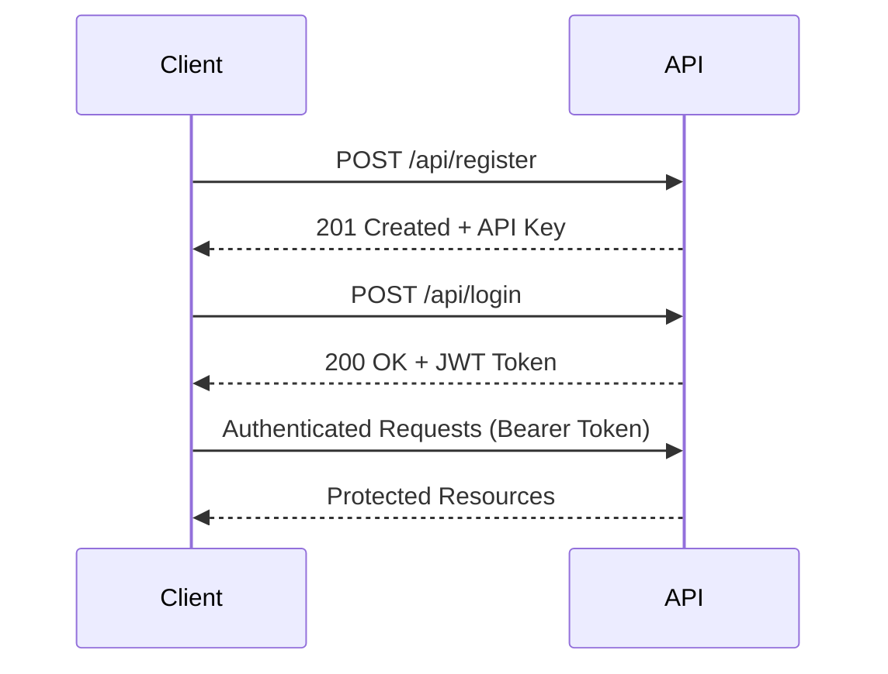

# 📡 API Documentation - Gold Trading Calculator v2.1.0

Complete REST API reference for the Gold Trading Calculator Multi-Account MT5 System.

## 🎯 API Overview

**Base URL**: `http://localhost:8080` (development) / `https://yourdomain.com` (production)  
**Authentication**: JWT Bearer Token  
**Content-Type**: `application/json`  
**API Version**: v2.1.0

### 🔒 Authentication Flow



---

## 🔐 Authentication Endpoints

### Register User

**POST** `/api/register`

Create a new user account with role-based access.

**Request Body:**
```json
{
  "username": "trader1",
  "email": "trader1@example.com",
  "password": "SecurePass123!",
  "role": "user"  // Optional: "user" | "broadcast" | "super_admin"
}
```

**Response (201 Created):**
```json
{
  "message": "User registered successfully",
  "user_id": 1,
  "api_key": "jKEG0Ql8bg_76tD1KTR8ILvqCLY77tK6hrmVq5VfPCk",
  "role": "user"
}
```

**Error Responses:**
- `400 Bad Request`: Missing required fields
- `409 Conflict`: Username or email already exists

### Login User

**POST** `/api/login`

Authenticate user and receive JWT token.

**Request Body:**
```json
{
  "username": "trader1",
  "password": "SecurePass123!"
}
```

**Response (200 OK):**
```json
{
  "message": "Login successful",
  "token": "eyJhbGciOiJIUzI1NiIsInR5cCI6IkpXVCJ9...",
  "user_id": 1,
  "role": "user",
  "expires_in": 86400
}
```

**Error Responses:**
- `400 Bad Request`: Missing credentials
- `401 Unauthorized`: Invalid credentials

---

## 💼 MT5 Account Management

### List MT5 Accounts

**GET** `/api/accounts`

Retrieve all MT5 accounts for the authenticated user.

**Headers:**
```
Authorization: Bearer <jwt_token>
```

**Response (200 OK):**
```json
{
  "accounts": [
    {
      "id": 1,
      "account_name": "Demo Account 1",
      "login": "12345678",
      "server": "MetaQuotes-Demo",
      "broker": "MetaQuotes",
      "account_type": "demo",
      "is_active": true,
      "created_at": "2025-08-17T10:30:00Z"
    }
  ],
  "total": 1
}
```

### Add MT5 Account

**POST** `/api/accounts`

Add a new MT5 account to user's profile.

**Headers:**
```
Authorization: Bearer <jwt_token>
Content-Type: application/json
```

**Request Body:**
```json
{
  "account_name": "Live Account 1",
  "login": "87654321",
  "password": "mt5password123",
  "server": "Broker-Live",
  "broker": "MyBroker",
  "account_type": "live"
}
```

**Response (201 Created):**
```json
{
  "message": "Account added successfully",
  "account_id": 2
}
```

### Connect to MT5 Account

**POST** `/api/accounts/{account_id}/connect`

Connect to specific MT5 account and receive updated token.

**Headers:**
```
Authorization: Bearer <jwt_token>
```

**Response (200 OK):**
```json
{
  "message": "Connected to MT5 account successfully",
  "token": "eyJhbGciOiJIUzI1NiIsInR5cCI6IkpXVCJ9...",
  "account_id": 1,
  "connection_status": "connected"
}
```

### Delete MT5 Account

**DELETE** `/api/accounts/{account_id}`

Remove MT5 account from user's profile.

**Headers:**
```
Authorization: Bearer <jwt_token>
```

**Response (200 OK):**
```json
{
  "message": "Account deleted successfully"
}
```

---

## 🧮 Trading Calculator

### Calculate Lot Size

**POST** `/api/calculate`

Calculate optimal lot size based on risk parameters.

**Headers:**
```
Authorization: Bearer <jwt_token>
Content-Type: application/json
```

**Request Body:**
```json
{
  "symbol": "XAUUSD",
  "entryPrice1": "2000.00",
  "stopLoss": "1990.00",
  "portfolioSize": "10000",
  "riskPercent": "2",
  "direction": "buy"
}
```

**Response (200 OK):**
```json
{
  "success": true,
  "results": {
    "lotSize": 2.0,
    "riskAmount": 200.0,
    "stopDistance": 10.0,
    "pipValue": 20.0,
    "tradeValue": 200000.0,
    "riskRewardRatio": "1:2",
    "calculations": {
      "contractSize": 100,
      "pointValue": 10,
      "marginRequired": 2000.0
    }
  },
  "symbol_info": {
    "symbol": "XAUUSD",
    "current_price": 2000.50,
    "spread": 0.30
  }
}
```

### Multi-Zone Calculation

**POST** `/api/calculate/multi-zone`

Calculate lot sizes for multiple entry zones.

**Request Body:**
```json
{
  "symbol": "XAUUSD",
  "zones": [
    {
      "entryPrice": "2000.00",
      "percentage": 50
    },
    {
      "entryPrice": "1995.00",
      "percentage": 30
    },
    {
      "entryPrice": "1990.00",
      "percentage": 20
    }
  ],
  "stopLoss": "1980.00",
  "portfolioSize": "10000",
  "riskPercent": "2"
}
```

**Response (200 OK):**
```json
{
  "success": true,
  "zones": [
    {
      "zone": 1,
      "entryPrice": "2000.00",
      "lotSize": 1.0,
      "percentage": 50,
      "riskAmount": 100.0
    },
    {
      "zone": 2,
      "entryPrice": "1995.00",
      "lotSize": 0.6,
      "percentage": 30,
      "riskAmount": 60.0
    },
    {
      "zone": 3,
      "entryPrice": "1990.00",
      "lotSize": 0.4,
      "percentage": 20,
      "riskAmount": 40.0
    }
  ],
  "totalLotSize": 2.0,
  "totalRisk": 200.0,
  "averageEntry": 1996.50
}
```

---

## 📊 System Information

### Health Check

**GET** `/api/status`

Check system health and availability.

**Response (200 OK):**
```json
{
  "status": "healthy",
  "version": "2.1.0",
  "timestamp": "2025-08-17T10:30:00Z",
  "database": "connected",
  "mt5_mode": "mock",
  "services": {
    "authentication": "operational",
    "calculator": "operational",
    "mt5_bridge": "operational"
  },
  "uptime": "2 days, 5 hours, 30 minutes"
}
```

### System Statistics

**GET** `/api/stats`

Get system usage statistics (Super Admin only).

**Headers:**
```
Authorization: Bearer <admin_jwt_token>
```

**Response (200 OK):**
```json
{
  "users": {
    "total": 150,
    "active": 142,
    "roles": {
      "user": 120,
      "broadcast": 25,
      "super_admin": 5
    }
  },
  "accounts": {
    "total_mt5_accounts": 287,
    "connected": 156,
    "demo": 198,
    "live": 89
  },
  "calculations": {
    "total_today": 456,
    "total_week": 2847,
    "avg_response_time": "75ms"
  }
}
```

---

## 📢 Broadcast System (Admin Only)

### Send Broadcast Order

**POST** `/api/broadcast/orders`

Send trading orders to all broadcast users (Super Admin only).

**Headers:**
```
Authorization: Bearer <admin_jwt_token>
Content-Type: application/json
```

**Request Body:**
```json
{
  "symbol": "XAUUSD",
  "entryPrice1": "2000.00",
  "stopLoss": "1990.00",
  "riskPercent": "2",
  "portfolioSize": "5000",
  "direction": "buy",
  "message": "Strong bullish signal on XAUUSD"
}
```

**Response (200 OK):**
```json
{
  "message": "Broadcast order sent successfully",
  "broadcast_id": "bc-2025-08-17-001",
  "target_users": 25,
  "delivered": 25,
  "failed": 0
}
```

### Get Broadcast Orders

**GET** `/api/broadcast/orders`

Retrieve broadcast orders (Broadcast users and Admins).

**Headers:**
```
Authorization: Bearer <jwt_token>
```

**Response (200 OK):**
```json
{
  "orders": [
    {
      "id": "bc-2025-08-17-001",
      "symbol": "XAUUSD",
      "entryPrice1": "2000.00",
      "stopLoss": "1990.00",
      "riskPercent": "2",
      "direction": "buy",
      "message": "Strong bullish signal on XAUUSD",
      "created_at": "2025-08-17T14:30:00Z",
      "status": "delivered"
    }
  ],
  "total": 1
}
```

---

## 🔒 Security Features

### Token Refresh

**POST** `/api/refresh`

Refresh JWT token before expiration.

**Headers:**
```
Authorization: Bearer <jwt_token>
```

**Response (200 OK):**
```json
{
  "token": "eyJhbGciOiJIUzI1NiIsInR5cCI6IkpXVCJ9...",
  "expires_in": 86400
}
```

### Change Password

**POST** `/api/change-password`

Change user password (requires current password).

**Headers:**
```
Authorization: Bearer <jwt_token>
Content-Type: application/json
```

**Request Body:**
```json
{
  "current_password": "OldPass123!",
  "new_password": "NewSecurePass456!",
  "confirm_password": "NewSecurePass456!"
}
```

**Response (200 OK):**
```json
{
  "message": "Password changed successfully"
}
```

---

## 📚 Error Handling

### Standard Error Response

All errors follow this format:

```json
{
  "error": "Error type",
  "message": "Detailed error description",
  "code": "ERROR_CODE",
  "timestamp": "2025-08-17T10:30:00Z"
}
```

### Common HTTP Status Codes

| Code | Description | Common Causes |
|------|-------------|---------------|
| `200` | OK | Successful request |
| `201` | Created | Resource created successfully |
| `400` | Bad Request | Invalid request format or missing fields |
| `401` | Unauthorized | Invalid or missing authentication token |
| `403` | Forbidden | Insufficient permissions for this action |
| `404` | Not Found | Resource doesn't exist |
| `409` | Conflict | Resource already exists (duplicate) |
| `422` | Unprocessable Entity | Invalid data format |
| `429` | Too Many Requests | Rate limit exceeded |
| `500` | Internal Server Error | Server-side error |

### Error Examples

**400 Bad Request:**
```json
{
  "error": "Validation Error",
  "message": "Missing required field: 'symbol'",
  "code": "MISSING_FIELD",
  "timestamp": "2025-08-17T10:30:00Z"
}
```

**401 Unauthorized:**
```json
{
  "error": "Authentication Error",
  "message": "Invalid or expired token",
  "code": "INVALID_TOKEN",
  "timestamp": "2025-08-17T10:30:00Z"
}
```

**403 Forbidden:**
```json
{
  "error": "Authorization Error",
  "message": "Insufficient permissions. Admin role required.",
  "code": "INSUFFICIENT_PERMISSIONS",
  "timestamp": "2025-08-17T10:30:00Z"
}
```

---

## 🧪 Testing the API

### Using cURL

```bash
# Register a new user
curl -X POST http://localhost:8080/api/register \
  -H "Content-Type: application/json" \
  -d '{
    "username": "testuser",
    "email": "test@example.com",
    "password": "Test123!",
    "role": "user"
  }'

# Login and get token
TOKEN=$(curl -X POST http://localhost:8080/api/login \
  -H "Content-Type: application/json" \
  -d '{
    "username": "testuser",
    "password": "Test123!"
  }' | jq -r '.token')

# Use token for authenticated requests
curl -X GET http://localhost:8080/api/accounts \
  -H "Authorization: Bearer $TOKEN"
```

### Using JavaScript/Fetch

```javascript
// Login and get token
const login = async () => {
  const response = await fetch('/api/login', {
    method: 'POST',
    headers: {
      'Content-Type': 'application/json'
    },
    body: JSON.stringify({
      username: 'testuser',
      password: 'Test123!'
    })
  });
  
  const data = await response.json();
  localStorage.setItem('jwt_token', data.token);
  return data.token;
};

// Make authenticated request
const getAccounts = async () => {
  const token = localStorage.getItem('jwt_token');
  const response = await fetch('/api/accounts', {
    headers: {
      'Authorization': `Bearer ${token}`
    }
  });
  
  return await response.json();
};
```

### Using Python Requests

```python
import requests
import json

# Base URL
BASE_URL = "http://localhost:8080"

# Login and get token
login_data = {
    "username": "testuser",
    "password": "Test123!"
}

response = requests.post(f"{BASE_URL}/api/login", json=login_data)
token = response.json()["token"]

# Use token for authenticated requests
headers = {"Authorization": f"Bearer {token}"}

# Get MT5 accounts
accounts = requests.get(f"{BASE_URL}/api/accounts", headers=headers)
print(accounts.json())

# Calculate lot size
calc_data = {
    "symbol": "XAUUSD",
    "entryPrice1": "2000.00",
    "stopLoss": "1990.00",
    "portfolioSize": "10000",
    "riskPercent": "2"
}

result = requests.post(f"{BASE_URL}/api/calculate", 
                      json=calc_data, headers=headers)
print(result.json())
```

---

## 🔄 Rate Limiting

The API implements rate limiting to prevent abuse:

- **General Endpoints**: 100 requests per hour per IP
- **Authentication Endpoints**: 10 requests per minute per IP
- **Calculation Endpoints**: 60 requests per minute per user

**Rate Limit Headers:**
```
X-RateLimit-Limit: 100
X-RateLimit-Remaining: 95
X-RateLimit-Reset: 1692270000
```

**Rate Limit Exceeded (429):**
```json
{
  "error": "Rate Limit Exceeded",
  "message": "Too many requests. Please try again later.",
  "code": "RATE_LIMIT_EXCEEDED",
  "retry_after": 3600
}
```

---

## 📖 Additional Resources

- **[Testing Guide](../TESTING_GUIDE.md)** - How to test API endpoints
- **[Deployment Guide](./guides/DEPLOYMENT_GUIDE.md)** - Production deployment
- **[Security Guide](./guides/SECURITY.md)** - Security best practices
- **[Troubleshooting](./guides/TROUBLESHOOTING.md)** - Common issues and solutions

---

**🔗 API Base URL**: `http://localhost:8080` (development)  
**📧 Support**: Create an issue on GitHub  
**📝 Version**: v2.1.0 (Last updated: August 17, 2025)
