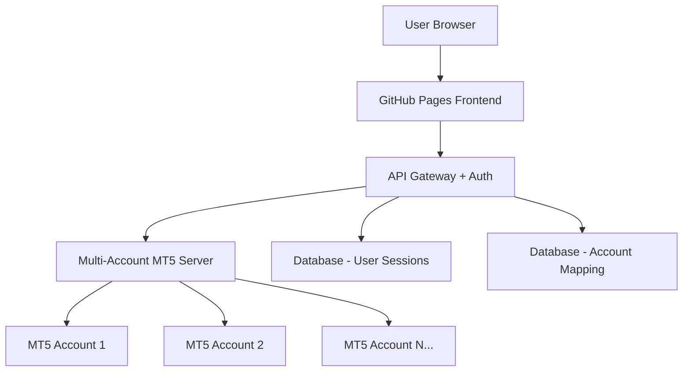

# 🔒 Hybrid Solution: GitHub Pages + Secure Multi-Account MT5 VPS

## 🏗️ Architecture Overview



### Components:
- **Frontend**: GitHub Pages (Free, Fast CDN)
- **Backend**: Secure VPS with Multi-Account Support
- **Security**: JWT Authentication, Account Isolation
- **Database**: User sessions and account management

---

## 🔐 Security Features

### Multi-Layer Security:
1. **🔑 JWT Authentication** - Secure user sessions
2. **👤 Account Isolation** - Each user only sees their accounts
3. **🔒 Encrypted Storage** - All credentials encrypted
4. **🛡️ API Rate Limiting** - Prevent abuse
5. **📝 Audit Logging** - Track all activities
6. **🌐 CORS Protection** - Domain whitelist
7. **🔐 HTTPS Only** - All communications encrypted

---

## 💾 Database Schema

### Users Table:
```sql
CREATE TABLE users (
    id INTEGER PRIMARY KEY AUTOINCREMENT,
    username VARCHAR(50) UNIQUE NOT NULL,
    email VARCHAR(100) UNIQUE NOT NULL,
    password_hash VARCHAR(255) NOT NULL,
    api_key VARCHAR(255) UNIQUE NOT NULL,
    created_at TIMESTAMP DEFAULT CURRENT_TIMESTAMP,
    last_login TIMESTAMP,
    is_active BOOLEAN DEFAULT TRUE
);
```

### MT5 Accounts Table:
```sql
CREATE TABLE mt5_accounts (
    id INTEGER PRIMARY KEY AUTOINCREMENT,
    user_id INTEGER NOT NULL,
    account_name VARCHAR(100) NOT NULL,
    login VARCHAR(50) NOT NULL,
    password_encrypted TEXT NOT NULL,
    server VARCHAR(100) NOT NULL,
    broker VARCHAR(100),
    account_type VARCHAR(20) DEFAULT 'demo',
    is_active BOOLEAN DEFAULT TRUE,
    created_at TIMESTAMP DEFAULT CURRENT_TIMESTAMP,
    FOREIGN KEY (user_id) REFERENCES users (id)
);
```

### Trading Sessions Table:
```sql
CREATE TABLE trading_sessions (
    id INTEGER PRIMARY KEY AUTOINCREMENT,
    user_id INTEGER NOT NULL,
    account_id INTEGER NOT NULL,
    session_token VARCHAR(255) NOT NULL,
    ip_address VARCHAR(45),
    user_agent TEXT,
    created_at TIMESTAMP DEFAULT CURRENT_TIMESTAMP,
    expires_at TIMESTAMP NOT NULL,
    is_active BOOLEAN DEFAULT TRUE,
    FOREIGN KEY (user_id) REFERENCES users (id),
    FOREIGN KEY (account_id) REFERENCES mt5_accounts (id)
);
```

---

## 📁 Project Structure

```
gold-trading-calculator/
├── frontend/                 # GitHub Pages Files
│   ├── index.html
│   ├── risk_calculator.html
│   ├── login.html
│   ├── dashboard.html
│   └── assets/
│       ├── css/
│       ├── js/
│       └── images/
├── backend/                  # VPS Server Files
│   ├── app.py               # Main Flask application
│   ├── auth/                # Authentication system
│   ├── mt5/                 # MT5 integration
│   ├── database/            # Database models
│   ├── security/            # Security utilities
│   └── config/              # Configuration files
└── deployment/              # Deployment scripts
    ├── setup_hybrid.ps1
    ├── docker-compose.yml
    └── nginx.conf
```
